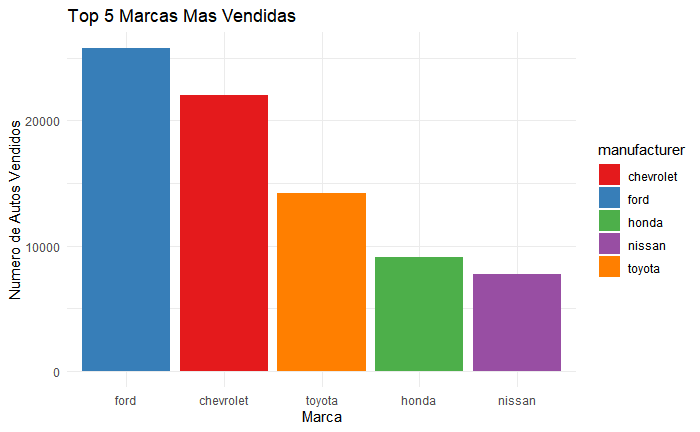
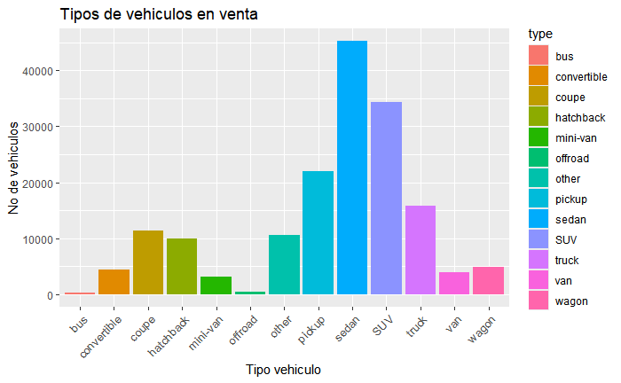
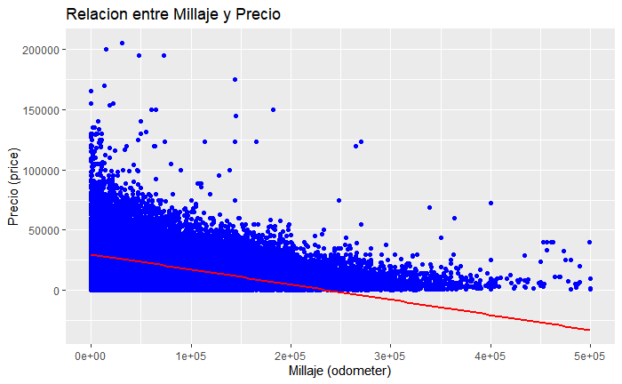
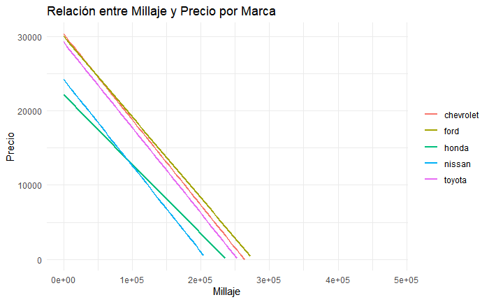
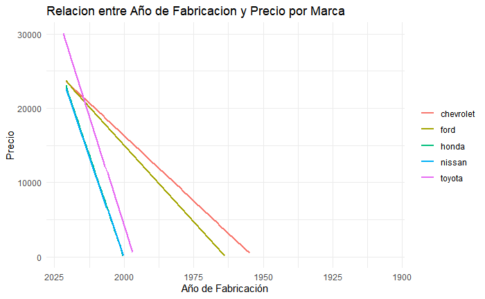

Analisis de Autos usados en USA
================
Vladimiro Cordero
2024-08-31

Usare el dataset subido por Austin Reese en Kaggle que se puede
descargar haciendo click
[aqui](https://www.kaggle.com/datasets/austinreese/craigslist-carstrucks-data),
Creditos a el por este increible dataset!

En este analisis plantee la siguiente pregunta: ¿que marcas y tipos de
vehiculo son los mas vendidos en USA y porque?, esto desencadeno algunas
otras preguntas: \* ¿Como y en que medida afecta el millaje al valor de
un vehiculo? \* ¿Que marcas se desprecian mas conforme aumenta su
millaje y año de fabricacion?

## Configuracion inicial

Cargamos las librerias necesarias:

``` r
library(tidyverse)  #Paquete general para analisis de datos
```

    ## ── Attaching core tidyverse packages ──────────────────────── tidyverse 2.0.0 ──
    ## ✔ dplyr     1.1.4     ✔ readr     2.1.5
    ## ✔ forcats   1.0.0     ✔ stringr   1.5.1
    ## ✔ ggplot2   3.5.1     ✔ tibble    3.2.1
    ## ✔ lubridate 1.9.3     ✔ tidyr     1.3.1
    ## ✔ purrr     1.0.2     
    ## ── Conflicts ────────────────────────────────────────── tidyverse_conflicts() ──
    ## ✖ dplyr::filter() masks stats::filter()
    ## ✖ dplyr::lag()    masks stats::lag()
    ## ℹ Use the conflicted package (<http://conflicted.r-lib.org/>) to force all conflicts to become errors

``` r
library(skimr)      #Interesa la funcion summarize para resumir los metadatos
library(dplyr)      #Para filtrar datos y obtener nuevos df de subconjuntos
library(broom)      #Algunos calculos y converciones utiles
```

## Limpieza y vistazo general de los datos

Creamos el dataframe:

``` r
autos_df = read_csv("vehicles.csv")
```

    ## Rows: 426880 Columns: 26
    ## ── Column specification ────────────────────────────────────────────────────────
    ## Delimiter: ","
    ## chr  (18): url, region, region_url, manufacturer, model, condition, cylinder...
    ## dbl   (6): id, price, year, odometer, lat, long
    ## lgl   (1): county
    ## dttm  (1): posting_date
    ## 
    ## ℹ Use `spec()` to retrieve the full column specification for this data.
    ## ℹ Specify the column types or set `show_col_types = FALSE` to quiet this message.

Eliminamos filas con caracteristicas clave faltantes:

``` r
autos_df = autos_df %>% drop_na(region, price, year, manufacturer, model, condition, odometer, transmission, type, paint_color)
```

Limpiemos para concentrarnos en autos con valores no mayores a 250 mil
dolares y millajes de no mas de 500 mil millas.

``` r
autos_df = autos_df %>%
  filter(price >= 100 & price <= 250000) %>%
  filter(odometer >= 0 & odometer <= 500000)
```

Exploremos cuantas marcas se venden en autos usados en USA:

``` r
unique(autos_df$manufacturer)
```

    ##  [1] "gmc"             "chevrolet"       "toyota"          "ford"           
    ##  [5] "jeep"            "nissan"          "ram"             "cadillac"       
    ##  [9] "honda"           "dodge"           "lexus"           "jaguar"         
    ## [13] "buick"           "chrysler"        "volvo"           "infiniti"       
    ## [17] "lincoln"         "acura"           "hyundai"         "mercedes-benz"  
    ## [21] "audi"            "bmw"             "mitsubishi"      "subaru"         
    ## [25] "alfa-romeo"      "volkswagen"      "mazda"           "porsche"        
    ## [29] "ferrari"         "kia"             "fiat"            "rover"          
    ## [33] "saturn"          "pontiac"         "mini"            "tesla"          
    ## [37] "harley-davidson" "mercury"         "datsun"          "land rover"     
    ## [41] "aston-martin"

Contemos el total de marcas:

``` r
length(unique(autos_df$manufacturer))
```

    ## [1] 41

## Respondamos algunas preguntas

### ¿Cuales son las marcas mas comunes?

Hallamos las 5 marcas mas comunes, dado que existen 41 marcas y no es
rentable graficar todas.

``` r
top5 = autos_df %>%
  count(manufacturer) %>%
  arrange(desc(n)) %>%
  top_n(5,n)
```

Grafiquemos:

``` r
ggplot(data = top5, aes(x = reorder(manufacturer, -n), y = n, fill = manufacturer)) +
  geom_bar(stat = "identity") +
  labs(title = "Top 5 Marcas Mas Vendidas",
       x = "Marca",
       y = "Numero de Autos Vendidos") +
  theme_minimal() +
  scale_fill_brewer(palette = "Set1")
```

<!-- -->

### ¿Cuales son los tipos de vehiculo mas comunes?

``` r
ggplot(data=autos_df) +
  geom_bar(mapping = aes(x=type, fill=type)) +
  labs(title= "Tipos de vehiculos en venta", x="Tipo vehiculo", y="No de vehiculos") +
  theme(axis.text.x = element_text(angle = 45, hjust = 1, size=10))
```

<!-- -->

### ¿Existe relacion entre el millaje y el precio?

Veamos que tanto varia el precio de los autos con relacion al millaje

``` r
ggplot(data = autos_df, aes(x = odometer, y = price)) +
  geom_point(color = "blue") +  # Agrega los puntos
  geom_smooth(method = "lm", color = "red", se = FALSE) +
  labs(title = "Relacion entre Millaje y Precio",
       x = "Millaje (odometer)",
       y = "Precio (price)")
```

    ## `geom_smooth()` using formula = 'y ~ x'

<!-- -->

De acuerdo con la linea roja de la regresion lineal podemos deducir que
los vehiculos pierden valor conforme aumenta su kilometraje.

Hasta ahora todo bien pero, ¿Que pasa con las 5 marcas mas vendidas de
USA? ¿Existe acaso alguna diferencia en la depreciacion conforme
aumentan las millas para cada marca?, veamos a continuacion las
respuestas.

Primero creamos nuevos dataframe para cada marca de autos:

``` r
toyota_df = autos_df %>% filter(manufacturer == "toyota")
ford_df = autos_df %>% filter(manufacturer == "ford")
chevrolet_df = autos_df %>% filter(manufacturer == "chevrolet")
honda_df = autos_df %>% filter(manufacturer == "honda")
nissan_df = autos_df %>% filter(manufacturer == "nissan")
```

Cada df tiene diferentes observaciones, para mantener equitativo el
analisis y evitar el sesgo tomaremos 7000 muestras aleatorias de cada
df.

``` r
set.seed(123) #Para aleatoriedad

muestras = 7000

toyota_df = toyota_df %>% sample_n(size = min(n(), muestras))
ford_df = ford_df %>% sample_n(size = min(n(), muestras))
chevrolet_df = chevrolet_df %>% sample_n(size = min(n(), muestras))
honda_df = honda_df %>% sample_n(size = min(n(), muestras))
nissan_df = nissan_df %>% sample_n(size = min(n(), muestras))
```

Creamos un df para graficar:

``` r
marcas_df = bind_rows(
  mutate(toyota_df, marca = "toyota"),
  mutate(ford_df, marca = "ford"),
  mutate(chevrolet_df, marca = "chevrolet"),
  mutate(honda_df, marca = "honda"),
  mutate(nissan_df, marca = "nissan")
)
```

Graficamos:

``` r
ggplot(data = marcas_df, aes(x = odometer, y = price, color = marca)) +
  geom_smooth(method = "lm", se = FALSE) +
  ylim(0, NA) +
  labs(title = "Relación entre Millaje y Precio por Marca",
       x = "Millaje",
       y = "Precio") +
  theme_minimal() +
  theme(legend.title = element_blank())
```

    ## `geom_smooth()` using formula = 'y ~ x'

    ## Warning: Removed 172 rows containing missing values or values outside the scale range
    ## (`geom_smooth()`).

<!-- -->

En el grafico se puede apreciar que honda es la marca que menos
depreciacion tiene conforme aumenta su millaje, pero para estar seguros
calculemos la pendiente de cada recta.

``` r
marcas_df %>%
  group_by(marca) %>%
  do(tidy(lm(price ~ odometer, data = .))) %>%
  filter(term == "odometer") %>%
  select(marca, estimate) %>%
  rename(pendiente = estimate) %>%
  arrange(desc(pendiente))
```

    ## # A tibble: 5 × 2
    ## # Groups:   marca [5]
    ##   marca     pendiente
    ##   <chr>         <dbl>
    ## 1 honda       -0.0932
    ## 2 ford        -0.109 
    ## 3 chevrolet   -0.115 
    ## 4 toyota      -0.115 
    ## 5 nissan      -0.116

En efecto la que menor depreciacion tiene es la marca honda y la que
mayor depreciacion tiene es nissan.

### Relacion entre el año y el precio

Ahora vamos a determinar como afecta el año en el precio de los
vehiculos para las 5 marcas mas vendidas en USA.

``` r
ggplot(data = marcas_df, aes(x = year, y = price, color = marca)) +
  geom_smooth(method = "lm", se = FALSE) +
  scale_x_reverse() +
  ylim(0, NA) +
  labs(title = "Relacion entre Año de Fabricacion y Precio por Marca",
       x = "Año de Fabricación",
       y = "Precio") +
  theme_minimal() +
  theme(legend.title = element_blank())
```

    ## `geom_smooth()` using formula = 'y ~ x'

    ## Warning: Removed 196 rows containing missing values or values outside the scale range
    ## (`geom_smooth()`).

<!-- -->

## Conclusiones

- Se vio que los estadounidenses prefieren las marcas de ford y
  chevrolet por encima de las demas, esto debido a que presentan menor
  depreciacion en cuanto al año de fabriacion del vehiculo pero tambien
  son marcas nacionales asi que puede deberse en parte a una preferencia
  personal de los ciudadanos.

- A pesar de ser la 4ta marca mas vendida en USA, Honda presento la
  menor depreciacion conforme aumenta el millaje de sus vehiculos por lo
  que podriamos decir que comprar un vehiculo Honda refleja una buena
  inversion si se planea usar mucho el vehiculo, sin embargo a largo
  plazo es mejor considerar vehiculos ford o chevrolet ya que presentan
  menor depreciacion conforme el pasar del tiempo.
